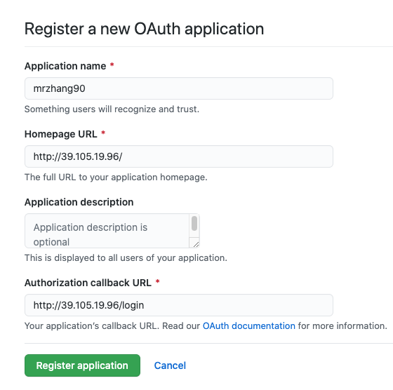
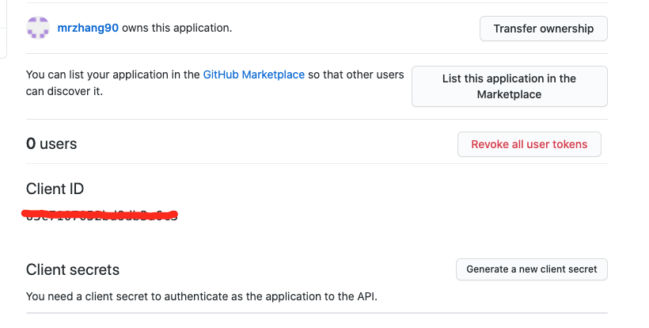

## 目标

1. 前端自动化构建部署从 0-1(nginx)
2. 熟悉 Drone 的基本原理
3. 使用 Drone 构建部署前端应用
4. 使用 Drone CLI Promote 指定环境
5. 具备基于 Drone API 的运维系统开发能力

## 环境

准备三台机子

```
39.105.19.96    //阿里云服务器，项目服务器
172.16.102.130  //centos虚拟机1，做Drone服务器
172.16.102.131  //ubuntu虚拟机2，做Drone客户端
```

## rsync 与 scp

rsync 与 scp 都可以传输文件到服务器，rsync 对文件做 MD5 对比，只上传差异文件，优先使用 rsync

## 安装 nginx

```
yum install nginx
systemctl start nginx
```

## [Drone](https://docs.drone.io/) 原理

1. Github repo

   - Push 代码时，推动到 Drone server master 远程服务器

2. Drone server master

   - 把任务写到 Drone server 数据库(Databse)

3. Drone agent（代理服务器）
   - 代理服务器监听到数据库变化，代理服务器通过 RPC 把任务发给 Drone server master
   - 代理服务器可以有多台

PS:一个 Drone 服务器只能对象一个 git 代码源

## 安装 Docker、drone

安装必要的系统工具

```
yum install -y yum-utils device-mapper-persistent-data lvm2
```

添加软件源

```
# 直接用yum安装是找不到docker-ce的，所以要先安装dorker-ce
yum-config-manager --add-repo http://mirrors.aliyun.com/docker-ce/linux/centos/docker-ce.repo
```

更新 yum 缓存

```
# yum makecache fast
# centos8没有该参数fast参数，所以直接去掉即可
yum makecache
```

安装 docker

```
# docker-ce 是免费的社区版
yum -y install docker-ce
```

配置国内镜像源

```
curl -ssl http://oyh1cogl9.bkt.clouddn.com/setmirror.sh | sh -s <镜像加速地址>
curl -sSL http://oyh1cogl9.bkt.clouddn.com/setmirror.sh | sh -s http://dockerhub.azk8s.cn #Azure

# https://github.com/Azure/container-service-for-azure-china/blob/master/aks/README.md#22-container-registry-proxy

# 重启docker
sudo systemctl restart docker
```

[Github-创建 OAuth 应用程序](https://docs.drone.io/server/provider/github/)

进入 Settings / Developer settings，然后 OAuth Apps，点击按钮“Register a new OAuth application”

**以下是我的项目示例，根据自己的实际情况**


**创建成功后，可以得到客户端 ID、客户端密钥**


#### [Drone Server - Docker 镜像下载](https://docs.drone.io/server/provider/github/)

    docker pull drone/drone:2

#### 生成环境下，可以用 openssl 生成一个随机密钥

    openssl rand -hex 16

#### 启动 Drone Server

```
docker run \
    # drone运行时的配置、数据等会存放到这个目录
  --volume=/var/lib/drone:/data \
   # github上的ClientID
  --env=DRONE_GITHUB_CLIENT_ID=31c7e74f0c978ce540db \
   # github上的密匙
  --env=DRONE_GITHUB_CLIENT_SECRET=1bc134cd78ae38c624f90785b7749ecc2a5125f0 \
   # 测试环境写12345678 线上环境生成一个随机的随机密钥
  --env=DRONE_RPC_SECRET=12345678 \
   # 填写github时的url，只写host，不要带http://
  --env=DRONE_SERVER_HOST=172.16.102.130 \
   # 协议，例如：http
  --env=DRONE_SERVER_PROTO=http \
  --publish=80:80 \
  --publish=443:443 \
  --restart=always \
  --detach=true \
  --name=drone \
  drone/drone:2
```

遇到报错，说 docker container 冲突了，那么

```
# 查询所有容器
docker container ls -all
# 删除冲突的容器ID
docker container rm 容器ID
```

## 运行 Deone 服务端

1. 访问地址
   http://172.16.102.130/
2. 正常会跳到 welcome 或 login 路由，正常登录即可
3. 然后会刷新出 github 所有项目，找到要配置 CI 的项目，点击进去
4. 激活，点击按钮“ACTIVATE REPOSITORY”

   激活的逻辑，是因为 drone 拿到 github 权限，drone 会在 github 项目的 settings->webhooks，加一条 webhooks 配置,这样当我们推代码、打 tag、Merge Request 时，会给这个 webhooks 地址推送 event，此时 droneCI 会收到通知，知道 github 仓库发生变化了，DroneCI 就会执行一系列的操作

## [Drone Pipelines](https://docs.drone.io/pipeline/overview/)

Drone 管道，可根据文档配置.yaml 文件

yaml 是类 json 格式，最终编译还是要转成 json 格式

[node 版本，选择合适的 docker 镜像版本](https://hub.docker.com/_/node?tab=tags&page=1&ordering=last_updated)

```
---
kind: pipeline
type: docker
name: default

steps:
  - name: npm install
    # hub.docker.com，找到node版本镜像
    image: node:14.17.5-alpine3.14
    commands:
        # 安装时，配置淘宝镜像
      - npm i --registry=https://registry.npm.taobao.org
```

## [Drone agent](https://docs.drone.io/runner/docker/installation/linux/)

#### 下载 Drone agent 镜像

```
docker pull drone/drone-runner-docker:1
```

#### 安装容器并启动 Docker

```
docker run -d \
  -v /var/run/docker.sock:/var/run/docker.sock \
  -e DRONE_RPC_PROTO=http \
  # drone server 地址
  -e DRONE_RPC_HOST=172.16.102.130 \
  # drone server时填的密钥，必须一致
  -e DRONE_RPC_SECRET=12345678 \
  -e DRONE_RUNNER_CAPACITY=2 \
  -e DRONE_RUNNER_NAME=node \
  -p 3000:3000 \
  --restart always \
  --name runner \
  drone/drone-runner-docker:1
```

## 配置 rsync

[drone 插件市场](https://plugins.drone.io/)

PS: 这里的插件有些不是最新的，最好根据镜像地址，去 github 上找原作者给的最新说明

```
- name: rsync production
    image: drillster/drone-rsync
    settings:
      user: root
      key:
        # 如果是本地直连服务器，可以配置密钥，但通过Drone agent代理服务器，就需要把服务器的密钥填到服务端
        # Drone服务器连接项目服务器，所以这里需要密钥，放到这里担心不安全，可以把本地的密匙配置到Drone server上
        # rsync_key 就是添加密钥时的名字
        from_secret: rsync_key
      hosts:
        - 39.105.19.96
      # 来源项目目录
      source: ./docs/.vuepress/dist/*
      # 目标服务器目录
      target: /doc
      # rsync_key 就是添加密钥时的名字，pipelines会去配置中找这个密钥的值
      secrets: [rsync_key]
```

添加密匙时，询问是否允许拉取请求，担心不安全，也可以不勾选

### DronceCI 不监听的问题

当 DronceCI 执行失败，再次提交代码没有触发自动构建时，可以点击“NEW BUILD”按钮，重新构建

## drone curl

[Pipelines Steps](https://docs.drone.io/pipeline/docker/syntax/steps/)

微信机器人

```
- name: notify
  image: curlimages/curl
  connands:
    # 链接上会有涉及转义的问题，用 |(竖线)+空格的方式解决
    - |
      curl 'https://xxx.com'
  when:
    status:
        # 当Drone Pipeline 执行成功或失败的时候，执行这里发消息
        - failure
        - success
```

## [Drone Promotions](https://docs.drone.io/promote/)

配置 Drone 部署流程，多环境部署

```
- name: rsync production
    image: drillster/drone-rsync
    settings:
      user: root
      key:
        # 如果是本地直连服务器，可以配置密钥，但通过Drone agent代理服务器，就需要把服务器的密钥填到服务端
        # Drone服务器连接项目服务器，所以这里需要密钥，放到这里担心不安全，可以把本地的密匙配置到Drone server上
        # rsync_key 就是添加密钥时的名字
        from_secret: rsync_key
      hosts:
        - 39.105.19.96
      # 来源项目目录
      source: ./docs/.vuepress/dist/*
      # 目标服务器目录
      target: /doc
      # rsync_key 就是添加密钥时的名字，pipelines会去配置中找这个密钥的值
      secrets: [rsync_key]
    when:
        targer:
            - production
        # promote 需要drone cli执行
        event:
            - promote

- name: rsync staging
    image: drillster/drone-rsync
    settings:
      user: root
      key:
        # 如果是本地直连服务器，可以配置密钥，但通过Drone agent代理服务器，就需要把服务器的密钥填到服务端
        # Drone服务器连接项目服务器，所以这里需要密钥，放到这里担心不安全，可以把本地的密匙配置到Drone server上
        # rsync_key 就是添加密钥时的名字
        from_secret: rsync_key
      hosts:
        - 39.105.19.96
      # 来源项目目录
      source: ./docs/.vuepress/dist/*
      # 目标服务器目录
      target: /doc
      # rsync_key 就是添加密钥时的名字，pipelines会去配置中找这个密钥的值
      secrets: [rsync_key]
    when:
        targer:
            - staging
        # promote 需要drone cli执行
        event:
            - promote
```

[执行 Drone Cli build 命令](https://docs.drone.io/cli/build/drone-build-promote/)

```
drone build promote mrzhang90/DroneCI 41 production

drone build promote mrzhang90/DroneCI 41 staging
```

## [Drone CLI](https://docs.drone.io/cli/install/)

1. 安装
   ```
   # 下载
   curl -L https://github.com/drone/drone-cli/releases/latest/download/drone_darwin_amd64.tar.gz | tar zx
   # 安装
   sudo cp drone /usr/local/bin
   ```
2. 配置

   从 drone server 服务器管理页面，点击个人头像，即可找到 sever 和 token

   ```
   # 配置drone服务器地址：
   export DRONE_SERVER=http://172.16.102.130
   # 配置drone token：
   export DRONE_TOKEN=IDQmPV7KL7XwXg6HVZo0XRSPV2COB6ON
   ```

3. 添加密钥

   ```
   # 切换到.ssh目录
   cd .ssh

   # 添加密钥
   drone secret add \
       --repository mrzhang90/DroneCI \
       --name rsync_key \
       # 添加本地的密钥文件，这个公钥一定是服务器有保存的
       --data @./id_rsa \
   ```

   密钥添加成功后，在 Drone 服务器管理平台的 Settings->Secrets 下，可以看到添加的密钥

## jsonnet

解决 yml 文件越写越庞大，jsonnet 可以复用

[drone jsonnet](https://docs.drone.io/template/jsonnet/)

[jsonnet 官方文档](https://jsonnet.org/)

## [Drone API](https://docs.drone.io/api/overview/)

[Drone API - node](https://github.com/drone/drone-node)
