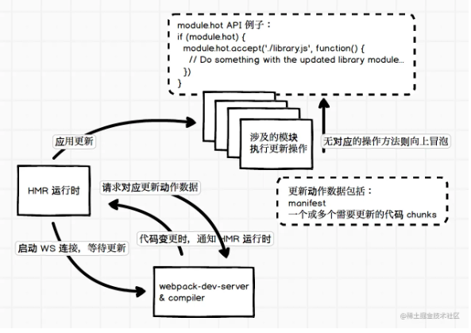

## 模块热替换
模块热替换，简称 HMR，全称 Hot Module Replacement，这个概念出来之前，我们使用过 Hot Reloading，当代码变更通知浏览器刷新页面，以避免频繁手动刷新浏览器页面。HMR 可以理解为增强版的 Hot Reloading，但不需要刷新整个页面，而是局部替换部分模块代码并且使其生效，可以看到变更后的效果。所以，HMR 既避免了频繁手动刷新页面，也减少了页面刷新时的等待，极大提升了前端页面开发效率

## 开箱即用
HMR在 webpack的 development mode 下，webpack-dev-erver，HMR 是开箱即用的功能
```js
module.exports={
  devServer:{
    hot:true
  }
}
```
## 运行原理
webpack内部运行时，会维护一份用于管理构建代码时各个模块之间交互的表数据，webpack官方称之为 Manifest，其中包括入口代码文件和构建出来的 bundle 文件对应的关系。可以使用 WebpackManifestPlugin 插件来输出这样的一份数据

**HMR 大致的运行流程图**


开启 hot 功能的 webpack 会往应用代码中添加 WS相关代码，用于和服务器保持连接，这个实现类似于 hot reloading，本地代码变更时通知浏览器做相应的处理

按照上图左部分的理解：当代码变更时，webpack-dev-server 会发送更新信号给 HMR 运行时，然后 HMR再请求所需要的更新数据，请求的更新数据没有问题就应用更新。

如果 HMR 只是简单的替换了代码模块的内容，如替换掉所谓的 installedModules 中所需要更新的部分，那么这样并没有办法把更新后的结果实时的在浏览器显示出来，所以才需要流程图的右上部分

HMR运行时会提供定义代码模块应用更新时的API，这些 API让我们在模块中定义接收到HMR更新应用信号时，需要额外做什么工作。例如，[style-loader](https://github.com/webpack-contrib/style-loader)就需要实现 HMR 接口，当收到更新时，使用新的样式替换掉旧的样式，大概是这样：
```js
if(module.hot){
  module.hot.accept('smoe/path',()=>{
    //... 用新样式替换旧样式
  })
}
```

HMR应用更新时是使用webpackHotUpdate来处理的：
```js
webpackHotUpdate(id, { 
  'modulePath': 
  function() {
    // 模块更新后的代码
  }
})
```
执行 webpackHotUpdate时，如果发现模块代码实现了 HMR接口，就会执行相应的回调或方法，从而达到更新应用时，模块可以自行管理自己所需要的额外做的工作。不过并不是所有的模块都需要做相关的处理，当遇见没有实现的 HMR 接口的模块时，就会往上层冒泡，如上流程图所示。

## module.hot
1. module.hot.accept
    该方法指定在应用特定代码模块更新时执行相关的 callback，第一个参数可以是字符串或数组
    ```js
    if (module.hot) {
      module.hot.accept(['./bar.js', './index.css'], () => {
        // ... 这样当 bar.js 或者 index.css 更新时都会执行该函数
      })
    }
    ```

    module.hot.accept 也可以用于处理自身的更新，api 的使用和上述差别不大，仅使用一个 callback 处理自身，更新时自身代码会执行一次，并且不会通知上层代码模块，即不会触发上层代码模块的accept callback
    ```js
    if (module.hot) {
      module.hot.accept((err) => {
        // 这里是异常回调，当更新异常时调用
      });
    }
    ```
2. module.hot.decline
    对于指定的代码模块，拒绝进行模块代码的更新，进入更新失败状态，如 ```module.hot.decline('./bar.js')```。这个方法比较少用到，如果不传参数的话，则表明自身模块是不可更新的。
3. module.hot.dispose 
    用于添加一个处理函数，在当前模块代码被替换时运行该函数，通常用于移除模块之前添加的持久化资源或者相关状态等，例如：
    ```js
    if (module.hot) {
      module.hot.dispose((data) => {
        // data 用于传递数据，如果有需要传递的数据可以挂在 data 对象上，然后在模块代码更新后可以通过 module.hot.data 来获取
      });

      // 这里可以通过判断 module.hot.data 来区分该模块是否为更新后的第二次执行
      if (module.hot.data) {
        // ...
      }
    }
    ```
4. module.hot.removeDisposeHandler 
    用于移除 dispose 方法添加的 callback。

关于 module.hot 的更多 API 详情可以参考官方文档：[Hot Module Replacement APIs](https://webpack.js.org/api/hot-module-replacement/#module-api)。
