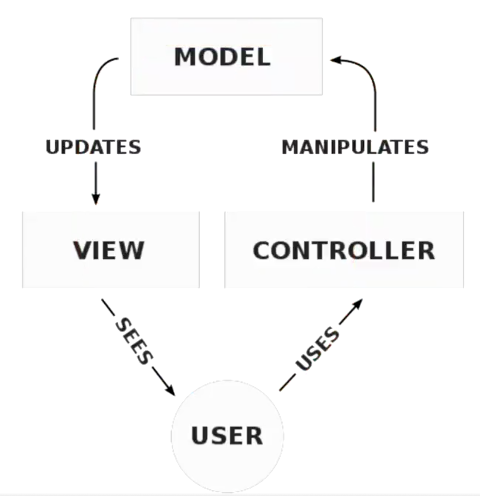

## 单体应用

前后端未分离的项目，叫做单体应用

### MVC 模式

MVC 模式，应该叫做 MVC 架构模式，与设计模式的区别在于，架构模式是设计系统的，设计模式是代码的书写规范

#### 一个典型的 web MVC 流程：

- Controller 截取用户发出的请求
- Controller 调用 Model 完成状态的读写操作
- Controller 把数据传递给 View
- View 渲染最终结果并呈现给用户

#### 深入理解 MVC 模式

## 配置环境

### 安装 XAMPP

https://www.apachefriends.org/download_success.html

## YII

[YII 中文文档](https://www.yiichina.com/doc/guide/2.0/start-installation)
[YII 下载](https://www.yiiframework.com/download)

PS:选择：“从存档文件安装”，这种安装方式最简单

## 参考

[Mac 配置 nginx、php 运行环境](https://www.cnblogs.com/niuben/p/14575854.html)
