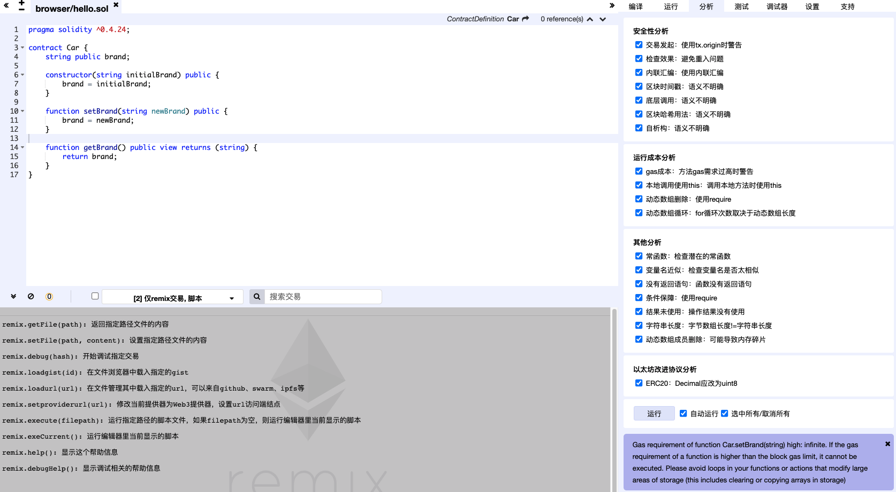

## solidity



```
Gas requirement of function Car.brand() high: infinite. If the gas requirement of a function is higher than the block gas limit, it cannot be executed. Please avoid loops in your functions or actions that modify large areas of storage (this includes clearing or copying arrays in storage)
```

大意为，Car 合约自动生成的 brand 函数可能会消耗无限的汽油，这是在智能合约设计时需要避免的，因为智能合约中的任何代码都是需要消耗汽油的，如果不加限制，很容易出现因为汽油不够而操作被回滚、或调用失败的情况。具体到我们的例子，brand 属性为字符串，在静态类型语言中字符串本质是动态长度的字节数组（dynamically-sized byte array），也就是说我们的 brand 属性是可能是非常长的字符数组，如果长度超过某个临界值，就会消耗超出预期的汽油，具体到我们的例子，只需要把 brand 的类型从 string 设置为 bytes32 即可，代码如下：

```
pragma solidity ^0.4.17;

contract Car {
    bytes32 public brand;

    function Car(bytes32 initialBrand) public {
        brand = initialBrand;
    }

    function setBrand(bytes32 newBrand) public {
        brand = newBrand;
    }

    function getBrand() public view returns (bytes32) {
        return brand;
    }
}
```

[汇智网-以太坊开发教程](http://www.hubwiz.com/course/?type=%E4%BB%A5%E5%A4%AA%E5%9D%8A&affid=blog7878)

[Solidity IDE Remix 中文版](http://blog.hubwiz.com/2019/04/29/solidity-ide-remix-cn/)

[Solidity IDE 中文在线 IDE](http://remix.hubwiz.com/#optimize=false&version=soljson-v0.5.1+commit.c8a2cb62.js)

## 自建智能合约工作流的动机和目标

### Remix

Remix 在智能合约的开发、编译、部署、测试上有便利，但是智能合约智能在浏览器中运行，比如我们不能方便的把合约部署到以太坊的主网或测试网络上

### Truffle

类似前端领域的各种全家桶种子项目(create-react-app、vue-cli)，帮你把各种关键模块(webpack、vue、eslint)组装好

### 环境准备

VScode，可以安装插件[Solidity](https://marketplace.visualstudio.com/items?itemName=JuanBlanco.solidity)或者[Solidity Extended](https://marketplace.visualstudio.com/items?itemName=beaugunderson.solidity-extended)

如果在 VSCode 中安装了 Solidity 插件，会自带 [Solium](https://github.com/duaraghav8/Ethlint) 代码检查工具，如果要调整 Solium 的配置，先打开 VSCode 的用户配置，在其中搜索 Solidity，修改 solidity.soliumRules 里面的缩进配置保存即可，当然保存代码风格配置之后，你还需要手动调整代码里面的缩进使之符合规范，因为 prettier 还不支持 Solidity 代码的格式化，不过如果你喜欢折腾，可以自己研究下：[prettier-plugin-solidity](https://github.com/prettier-solidity/prettier-plugin-solidity)

### 项目准备

```js
//初始化一个空目录
mkdir ethereum-contract-workflow
cd ethereum-contract-workflow
//初始化package.json和git仓库
npm init -y
git init
// 忽略文件
echo "node_modules" >> .gitignore
```

### 目录结构

为了分门别类的存放代码文件，我们在项目根目录下下面新建 4 个子目录：

```
mkdir contracts
mkdir scripts
mkdir compiled
mkdir tests
```

其中 contracts 目录存放合约源代码，scripts 目录存放我们的编译、部署脚本，complied 目录存放编译结果，tests 目录存放单元测试。最后我们的目录结构如下：

```
.
├── .gitignore
├── compiled
├── contracts
├── package.json
├── scripts
└── tests
```

### 编写智能合约编译脚本：compiled

智能合约的编译，是对合约进行部署和测试的前置步骤，编译步骤的目标是把**源代码转成 ABI 和 Bytecode**，并且能够处理编译时抛出的错误，确保不会在包含错误的源代码上进行编译。

## web3.js

1. 以太坊是基于 go 语言开发的(geth)，
   web3.js 是前端调用的，可以和以太坊的 api 进行交互的 javascript API
2. web3.js 内部使用了 JSON-RPC 与 geth 通信
