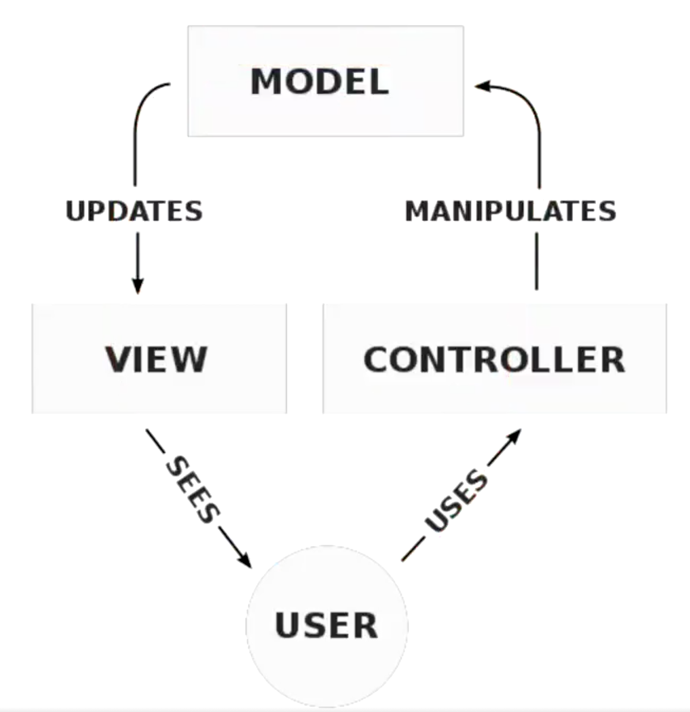
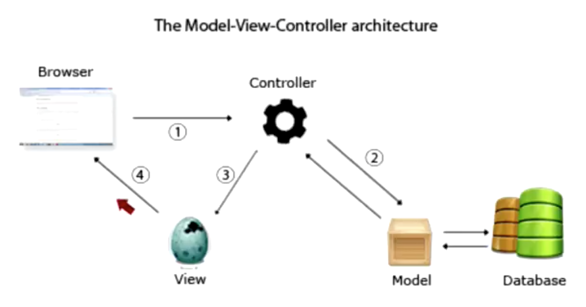

## 单体应用

前后端未分离的项目，叫做单体应用

### MVC 模式

MVC 模式，应该叫做 MVC 架构模式，与设计模式的区别在于，架构模式是设计系统的，设计模式是代码的书写规范



#### 一个典型的 web MVC 流程：

- Controller 截取用户发出的请求
- Controller 调用 Model 完成状态的读写操作
- Controller 把数据传递给 View
- View 渲染最终结果并呈现给用户

#### 深入理解 MVC 模式



## 配置环境

### 安装 XAMPP

https://www.apachefriends.org/download_success.html

### 安装 mysql

https://dev.mysql.com/downloads/mysql/

版本选择 DMG Archive，傻瓜式安装即可，最后要输入一个复杂密码(用户连接数据库的密码)，一定记住密码

安装完成后，点击系统偏好设置，选择 MySql，开启服务

想在终端直接使用 Mysql 命令，需要配置

```
vim .bash_profile
  # 配置mysql路径
  export PATH=${PATH}:/usr/local/mysql/bin
  # 配置mysql别名，这样配置就可以使用mysql命令
  alias mysql='/usr/local/mysql/bin/mysql'
  # 配置mysqladmin别名
  alias mysqladmin='/usr/local/mysql/bin/mysqladmin'
```

让文件生效

```
source .bash_profile
```

在终端输入 mysql -V,显示 mysql 版本信息，表示路径配置成功

```
mysql -V
```

连接数据库

```
#因为设置了别名可以直接用mysql，否则要/usr/local/mysql/bin/mysql -u root -p
mysql -u root -p
```

退出时，用 exit

### 配置 PHP

```
# mac 默认支持 php 的，输入 php -v，显示版本信息，表示 php 已存在，简单配置一下即可
php -v
```

1. 新建 php-fpm.conf 文件

```
sudo cp /private/etc/php-fpm.conf.default /private/etc/php-fpm.conf
```

2. 编辑 php-fpm 文件，修改 error_log 路径

```
error_log = /usr/local/var/log/php-fpm.log
```

否则 php-fpm 时会报错

```
ERROR: failed to open error_log (/usr/var/log/php-fpm.log): No such file or directory (2)
```

3. 进入 PHP 安装目录/etc/php-fpm.d

```
cp www.conf.default www.conf
```

否则会报错

```
php-fpm ERROR: No pool defined. at least one pool section must be specified in config file
```

4. 启动 php-form

```
sudo php-fpm
```

## YII

[YII 中文文档](https://www.yiichina.com/doc/guide/2.0/start-installation)
[YII 下载](https://www.yiiframework.com/download)

## 参考

[Mac 配置 nginx、php 运行环境](https://www.cnblogs.com/niuben/p/14575854.html)
