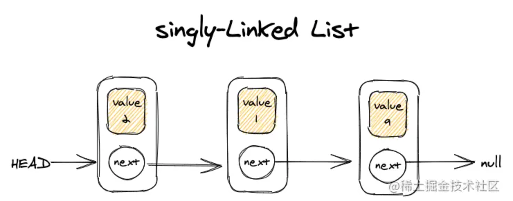
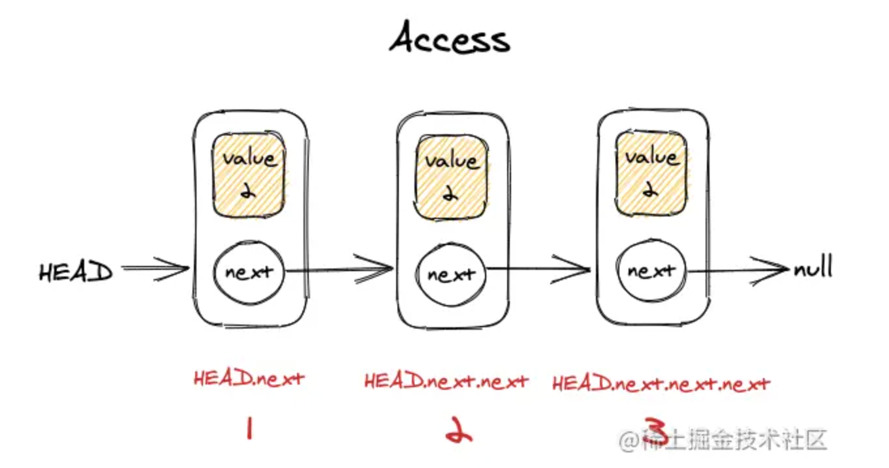
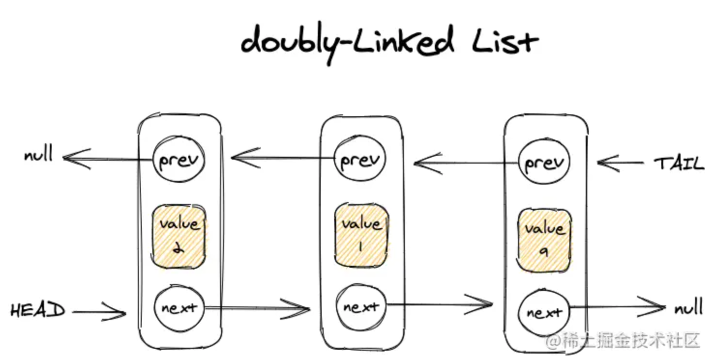
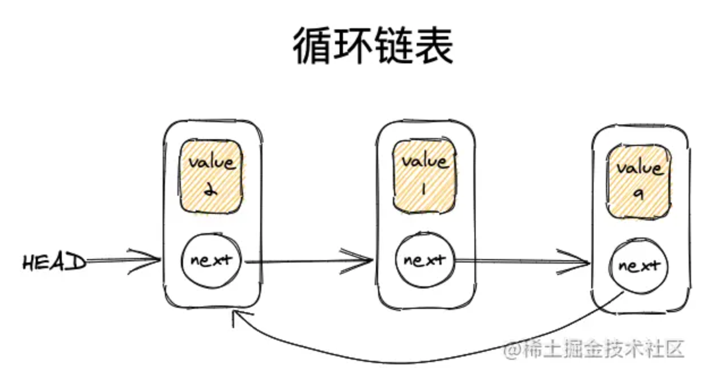

## 数组与链表

链表是数据结构当中的一种线性表，**链表是链式存储的，它在内存当中的内存分配不是连续的，要通过指针来链接**，而数组是顺序存储的，它在内存当中的空间分配是连续的，连续的意味着我们只需要知道数组的首地址就可以访问数组当中的每一个元素。

当线性表需要频繁查找，较少插入和删除时，宜采用顺序存储结构。

当事先知道线性表的大小长度，用顺序存储结构效率会高一些

**若需要频繁插入和删除，宜采用单链表**

**当线性表的元素个数变化较大或不确定时，最好用单链表，这样不需要考虑存储空间大小问题。**

## Linked List 链表

常见的链表：

1. singly-Linked List 单链表
1. doubly-Linked List 双链表
1. 循环链表
1. 双向循环链表
1. ...

## 单链表

### 访问

相对于数组，链表的好处在于，添加或删除元素的时候，不需要移动其他元素。数组的另一个细节是可以直接访问任何位置的任何元素，而链表访问一个中间元素，需要从起点(HEAD 表头)开始迭代，直接找到所需元素，如访问链表中的第一个元素可以表示为 HEAD.next，第二个元素表示为 HEAD.next.next,如下图

- 访问链表的第一个元素，为最优时间复杂度 O(1),只进行一次查询；
- 访问链表中的最后一个元素，为最差时间复杂度为 0(n)，需要迭代整个链表；
- 访问链表中间的元素，为平均时间复杂度 O(n/2);

### 插入

在 prev 节点和 current 节点中间插入一个 node 节点，可以这样做：

第一步：使 node.next 的值 指向 current 节点

第二步：使 prev.next 的值 指向 node 节点

这样链表中就多了一个节点，进行 2 次操作，时间复杂度为 0(2) ~ O(1)

### 删除

如删除 prev 节点和 current 节点中间的节点，可以这样做：

使 prev.next 指向 current 节点，即可完成中间节点的删除，时间复杂度为 O(1)

## 双链表

相比于单链表，双链表多了 prev 属性，指向上一级

## 循环链表

相比于单链表，循环链表的最后一个元素指向下一个节点不是 null，而是第一个节点

## 双向循环链表

双向循环链表和双链表区别在于：HEAD 节点的 prev 指针指向 TAIL，TAIL 节点的 next 指针指向 HEAD

## 数组与链表时间复杂度对比

| 数据结构         | Access - AVG | Search - AVG | Insertion - AVG | Deletion - AVG |
| ---------------- | ------------ | ------------ | --------------- | -------------- |
| Array 数组       | 0(1)         | 0(n)         | 0(n)            | 0(n)           |
| Linked List 链表 | 0(n)         | 0(n)         | 0(1)            | 0(1)           |

## 参考

[JavaScript 数据结构和算法——链表](https://juejin.cn/post/7083834869654126605#heading-1)
